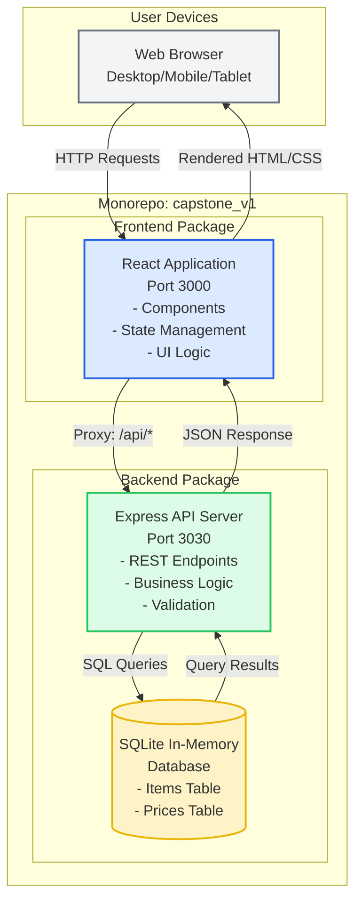
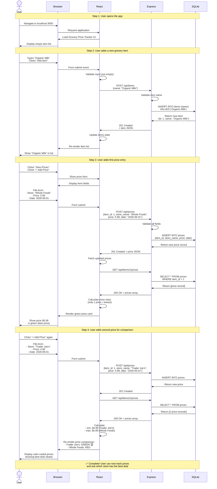
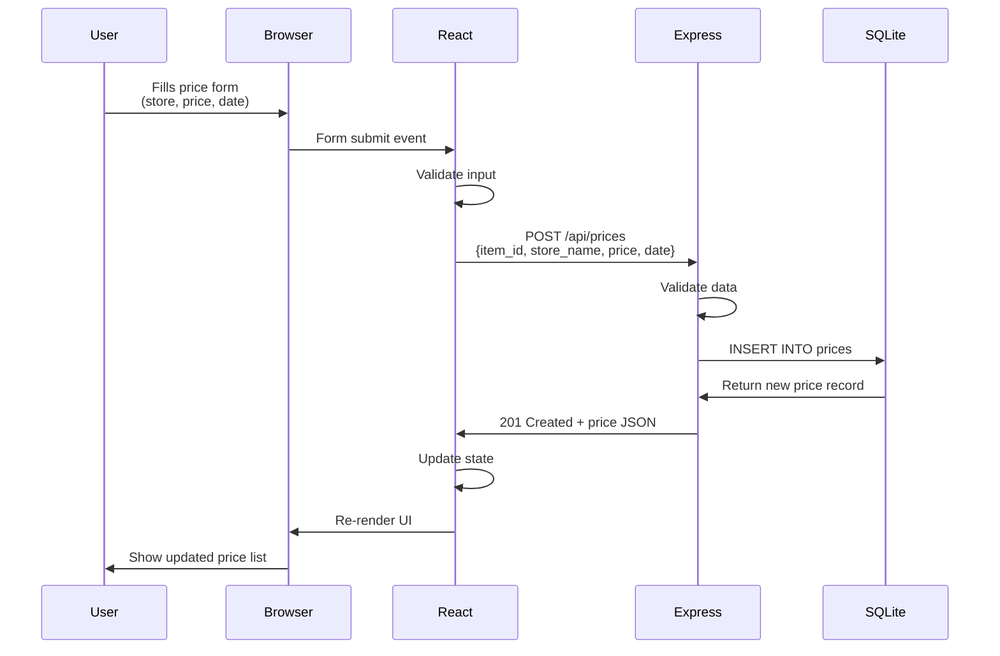
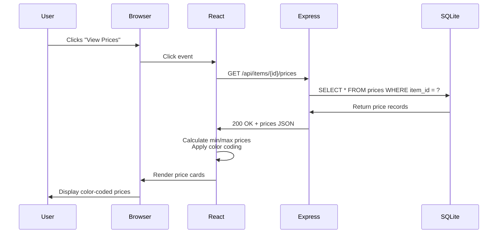
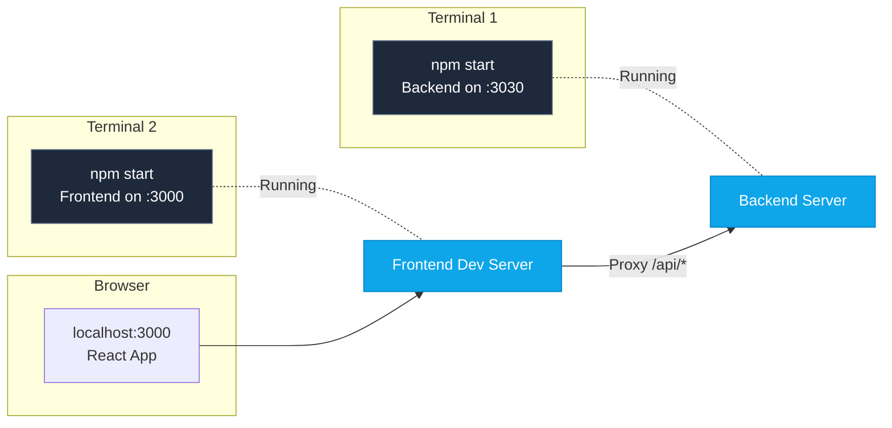

# Cloud Architecture Overview - Grocery Price Tracker

**Project:** Grocery Price Comparison Tracker  
**Architecture Type:** Monorepo Web Application  
**Last Updated:** June 1, 2026

---

## System Context Diagram



---

## Architecture Components

### 1. Frontend (React Application)
- **Technology:** React 18.2.0
- **Development Port:** 3000
- **Build Tool:** React Scripts 5.0.1
- **Location:** `packages/frontend/`

**Responsibilities:**
- User interface rendering
- Client-side state management
- Form validation
- API communication via fetch
- Responsive design implementation

**Key Features:**
- Item management UI (add, edit, delete)
- Price tracking forms
- Price comparison display with color coding
- Mobile-responsive design

---

### 2. Backend (Express API Server)
- **Technology:** Node.js with Express 4.18.2
- **Development Port:** 3030
- **Location:** `packages/backend/`

**Responsibilities:**
- RESTful API endpoints
- Business logic processing
- Input validation and sanitization
- Database operations
- Error handling and logging

**API Endpoints:**
```
Items:
- GET    /api/items       - List all items
- POST   /api/items       - Create item
- GET    /api/items/:id   - Get single item
- PUT    /api/items/:id   - Update item
- DELETE /api/items/:id   - Delete item

Prices:
- GET    /api/items/:id/prices - List prices for item
- POST   /api/prices           - Create price entry
- GET    /api/prices/:id       - Get single price
- PUT    /api/prices/:id       - Update price
- DELETE /api/prices/:id       - Delete price
```

**Middleware:**
- CORS (Cross-Origin Resource Sharing)
- Express JSON body parser
- Morgan (HTTP request logging)

---

### 3. Database (SQLite In-Memory)
- **Technology:** better-sqlite3 11.10.0
- **Type:** In-memory (data resets on server restart)
- **Location:** Backend process memory

**Schema:**

```sql
-- Items Table
CREATE TABLE items (
  id INTEGER PRIMARY KEY AUTOINCREMENT,
  name TEXT NOT NULL UNIQUE,
  created_at TIMESTAMP DEFAULT CURRENT_TIMESTAMP
);

-- Prices Table
CREATE TABLE prices (
  id INTEGER PRIMARY KEY AUTOINCREMENT,
  item_id INTEGER NOT NULL,
  store_name TEXT NOT NULL,
  price REAL NOT NULL,
  date DATE NOT NULL,
  notes TEXT,
  created_at TIMESTAMP DEFAULT CURRENT_TIMESTAMP,
  FOREIGN KEY (item_id) REFERENCES items(id) ON DELETE CASCADE
);
```

**Characteristics:**
- Lightweight and fast
- No external database server required
- Suitable for MVP/development
- Data is volatile (resets on restart)

---

## Data Flow

### User Journey: Creating a Grocery Item Tracker



### Adding a Price Entry



### Viewing Price Comparison



---

## Development Environment

### Local Development Setup



**Development Commands:**
```bash
# Backend
cd packages/backend
npm start              # Start with nodemon (auto-reload)
npm test              # Run tests

# Frontend  
cd packages/frontend
npm start              # Start development server
npm test              # Run tests
npm run build         # Production build
```

---

## Network Configuration

### Port Assignments
- **Frontend Development Server:** 3000
- **Backend API Server:** 3030
- **Proxy Configuration:** Frontend proxies `/api/*` requests to backend

### CORS Policy
```javascript
// Backend allows all origins in development
app.use(cors());
```

---

## Current Limitations (MVP)

1. **Data Persistence:** In-memory database - data lost on server restart
2. **Authentication:** No user accounts or authentication
3. **Scalability:** Single-instance application
4. **State Management:** Client-side state only (no Redux/Context)
5. **File Storage:** No image/file upload capability
6. **Deployment:** Not production-ready (development configuration)

---

## Future Architecture Considerations

### Post-MVP Enhancements

```mermaid
graph TB
    subgraph "Future: Production Architecture"
        LB[Load Balancer]
        
        subgraph "Static Hosting"
            CDN[CDN/Static Site<br/>React Build]
        end
        
        subgraph "API Layer"
            API1[Express API<br/>Instance 1]
            API2[Express API<br/>Instance 2]
        end
        
        subgraph "Data Layer"
            DB[(PostgreSQL<br/>Persistent DB)]
            Cache[(Redis<br/>Session Cache)]
            S3[S3/Cloud Storage<br/>Receipt Images]
        end
        
        subgraph "Auth"
            Auth[Auth Service<br/>JWT Tokens]
        end
    end
    
    Users[Users] --> LB
    LB --> CDN
    LB --> API1
    LB --> API2
    API1 --> DB
    API2 --> DB
    API1 --> Cache
    API2 --> Cache
    API1 --> S3
    API2 --> Auth
```

**Planned Improvements:**
- Persistent database (PostgreSQL)
- User authentication (JWT)
- Cloud storage for receipt images
- API caching layer (Redis)
- Container deployment (Docker)
- CI/CD pipeline
- Multiple environment support (dev/staging/prod)

---

## Security Considerations

### Current Implementation (MVP)
- ✅ Prepared SQL statements (prevents SQL injection)
- ✅ Input validation on backend
- ✅ CORS enabled
- ✅ Error messages don't expose sensitive data
- ⚠️ No authentication/authorization
- ⚠️ No HTTPS (development only)
- ⚠️ No rate limiting
- ⚠️ No data encryption

### Required for Production
- [ ] HTTPS/TLS encryption
- [ ] User authentication
- [ ] Authorization/access control
- [ ] Rate limiting
- [ ] Input sanitization
- [ ] Security headers
- [ ] Environment variable management
- [ ] Audit logging

---

## Performance Characteristics

### Current Performance (MVP)
- **Page Load:** < 3 seconds (development)
- **API Response Time:** < 100ms (in-memory DB)
- **Database Queries:** No indexes (small dataset)
- **Frontend Bundle:** ~200KB (unoptimized)

### Optimization Opportunities
- Production build minification
- Code splitting
- Image optimization
- Database indexing
- API response caching
- Service worker for offline support

---

## Monitoring and Observability

### Current Logging (MVP)
```javascript
// Backend: Morgan HTTP logging
app.use(morgan('dev'));

// Console logging for errors
console.error('Error message', error);
```

### Future Monitoring Needs
- Application Performance Monitoring (APM)
- Error tracking (Sentry, Rollbar)
- Analytics (Google Analytics, Mixpanel)
- Server monitoring (CPU, memory, disk)
- API endpoint metrics
- User behavior tracking

---

## Technology Stack Summary

| Layer | Technology | Version | Purpose |
|-------|-----------|---------|---------|
| Frontend Framework | React | 18.2.0 | UI rendering |
| Frontend Build | React Scripts | 5.0.1 | Development/build |
| Backend Framework | Express | 4.18.2 | API server |
| Runtime | Node.js | Latest LTS | JavaScript runtime |
| Database | SQLite (better-sqlite3) | 11.10.0 | Data storage |
| HTTP Client | Fetch API | Native | API calls |
| Logging | Morgan | 1.10.0 | Request logging |
| Testing (Frontend) | Jest + React Testing Library | 29.7.0 | Unit/integration tests |
| Testing (Backend) | Jest + Supertest | 29.7.0 | API tests |

---

## Deployment Considerations

### Development Environment (Current)
```
Local Machine
├── Backend: localhost:3030
├── Frontend: localhost:3000
└── Database: In-memory
```

### Production Environment (Future)
```
Cloud Provider (AWS/Azure/GCP/Vercel)
├── Frontend: Static hosting (S3, Netlify, Vercel)
├── Backend: Container service (ECS, Cloud Run)
└── Database: Managed database (RDS, Cloud SQL)
```

---

## Related Documentation

- [Functional Requirements](functional-requirements.md)
- [PRD with TODO List](prd-todo.md)
- [Epics and Stories](epics-and-stories.md)
- [Coding Guidelines](coding-guidelines.md)
- [UI Guidelines](ui-guidelines.md)

---

## Version History

| Version | Date | Changes |
|---------|------|---------|
| 1.0 | June 1, 2026 | Initial architecture documentation for MVP |
